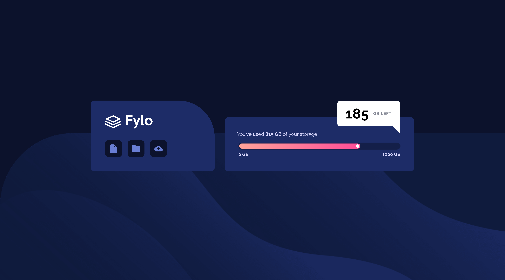

# Frontend Mentor - Fylo data storage component solution

This is a solution to the [Fylo data storage component challenge on Frontend Mentor](https://www.frontendmentor.io/challenges/fylo-data-storage-component-1dZPRbV5n). Frontend Mentor challenges help you improve your coding skills by building realistic projects. 

## Table of contents

- [Overview](#overview)
  - [The challenge](#the-challenge)
  - [Screenshot](#screenshot)
  - [Links](#links)
- [My process](#my-process)
  - [Built with](#built-with)
  - [What I learned](#what-i-learned)
  - [Continued development](#continued-development)
  - [Useful resources](#useful-resources)
- [Author](#author)

## Overview

### The challenge

Users should be able to:

- View the optimal layout for the site depending on their device's screen size

### Screenshot

### Links

- GitHub Repo: [https://github.com/IamAbhiDev/fylo-data-storage-component-master.github.io](https://github.com/IamAbhiDev/fylo-data-storage-component-master.github.io)
- Live Site URL: [https://iamabhidev.github.io/fylo-data-storage-component-master.github.io](https://iamabhidev.github.io/fylo-data-storage-component-master.github.io)

## My process

### Built with

- Semantic HTML5 markup
- CSS custom properties
- Flexbox
- CSS Grid
- Mobile-first workflow

### What I learned

Completing the Fylo data storage component challenge on Frontend Mentor provided an excellent opportunity for me to brush up on my CSS skills. The challenge was about a simple and static HTML-CSS layout with responsive design, which allowed me to enhance my ability to style elements using CSS properties. Throughout the process, I revisited essential concepts such as selectors, positioning, and the box model, which helped me reinforce my foundational knowledge. Moreover, I practiced version control with Git, which enabled me to track changes effectively. This project not only deepened my understanding of essential CSS principles but also refreshed my knowledge of responsive design, making the experience exceptionally rewarding.

### Continued development

In the future, I plan to incorporate JavaScript to enhance user interactions and add dynamic elements to my projects. This challenge has inspired me to continue developing my skills and creating more engaging web experiences.

### Useful resources

- [Accessibility Insights](https://accessibilityinsights.io) - This chrome extension allowed me to run automated checks to test the accessibility of my website. I found it to be really useful in identifying potential issues and ensuring that my website is easily accessible to all visitors.

## Author

- GitHub - [@IamAbhiDev](https://github.com/IamAbhiDev)
- Frontend Mentor - [@IamAbhiDev](https://www.frontendmentor.io/profile/IamAbhiDev)
- Twitter - [@IamAbhiDev](https://www.twitter.com/IamAbhiDev)